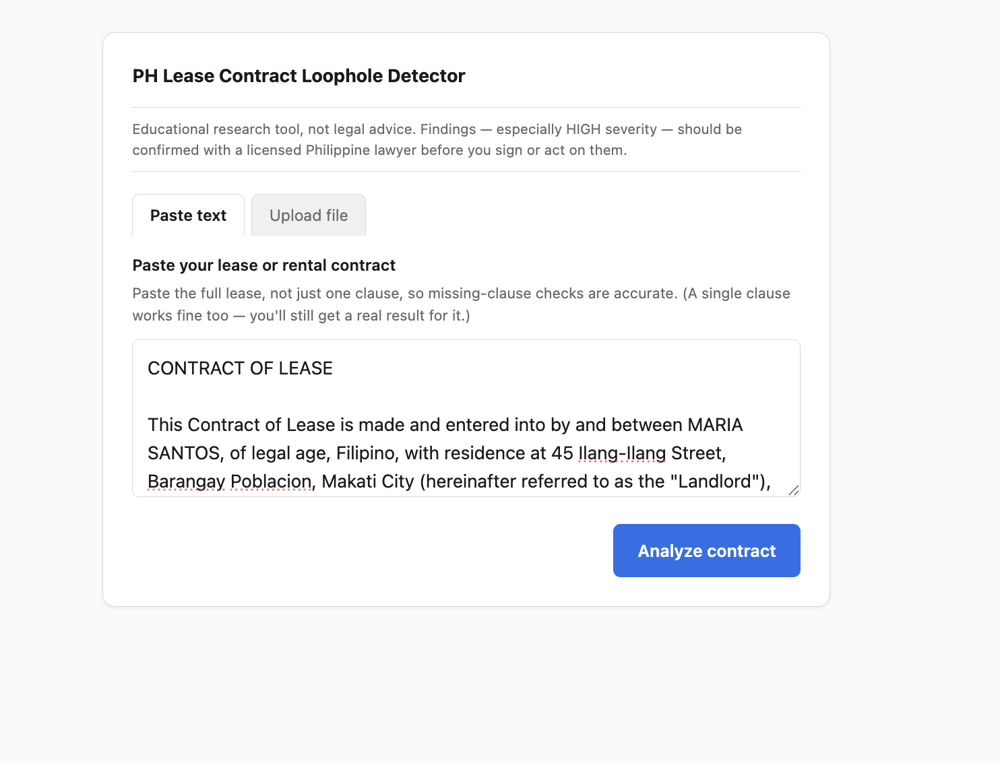
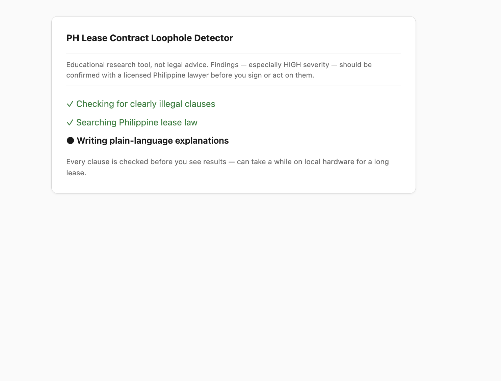
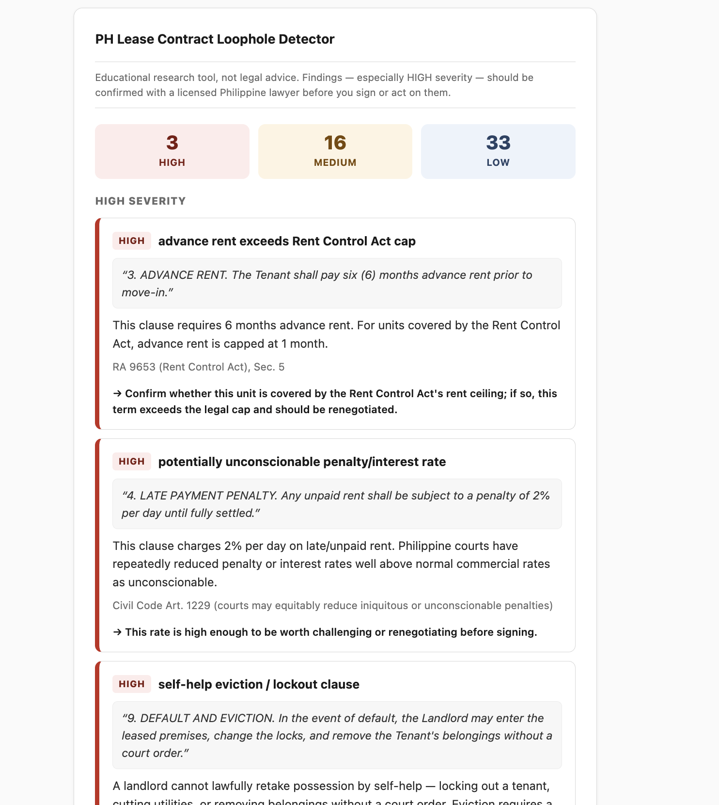

# PH Lease Contract Loophole Detector

Paste or upload a Philippine residential lease contract and, within
seconds (well, minutes on local hardware — see below), see its clauses
ranked by real risk (HIGH/MEDIUM/LOW), each with a plain-language reason,
a real citation, and a suggested action. Educational research tool, not
legal advice — see the disclaimer shown on every result.

Full design rationale, primary flow, and scope decisions live in
[PLAN.md](PLAN.md).

## Screenshots

| Input | Loading | Results |
|---|---|---|
|  |  |  |

## How it works

One request runs three independent findings sources over the contract,
merged into a single scorecard:

- **`severity`** — deterministic, rule-based checks for clauses that are
  illegal or void under Philippine law (HIGH).
- **`checklist`** — deterministic check for expected clause topics the
  contract doesn't appear to address (LOW, only runs once the text looks
  lease-shaped).
- **`retrieve` + `generate`** — hybrid (dense + keyword) search over a
  curated Philippine lease-law knowledge base, floor-gated, explained by an
  LLM (MEDIUM/LOW) — local (Ollama) by default, or the Claude API, see
  `-llm-provider` below. Embedding for retrieval always stays on Ollama
  regardless of this choice — Anthropic has no embeddings endpoint.

## Prerequisites

- [Go](https://go.dev/) 1.26+ (see [go.mod](go.mod))
- [Ollama](https://ollama.com/), running locally, with both models pulled:
  ```
  ollama pull nomic-embed-text
  ollama pull qwen2.5:7b
  ```
- [Qdrant](https://qdrant.tech/), running locally (gRPC on `6334`), e.g.:
  ```
  docker run -p 6333:6333 -p 6334:6334 qdrant/qdrant
  ```
- Only if running `cmd/server -llm-provider=claude` (see below): Anthropic
  credentials available to the process — typically an `ANTHROPIC_API_KEY`
  environment variable. Not needed for the default local setup.

## Install

```
git clone <this repo>
cd ph-contract-loophole-detector
go build ./...
git config core.hooksPath .githooks
```
The last line enables a pre-commit check that blocks committing anything
that looks like a live Anthropic API key (`.githooks/pre-commit`) — a
backstop, since the code itself never hardcodes one (see `-llm-provider`
below).

## Running locally

1. **Ingest the corpus** (once, or whenever `data/corpus/lease_corpus.json`
   changes) — loads the knowledge base into Qdrant + a local Bleve index:
   ```
   go run ./cmd/ingest
   ```
   Add `-fresh` to drop and rebuild both indexes from scratch instead of
   upserting into whatever's already there.

2. **Start the server**:
   ```
   go run ./cmd/server
   ```
   Then open [http://localhost:8080](http://localhost:8080).

Both commands share the same `-bleve`/`-qdrant-host`/`-qdrant-port` flag
defaults, so no flags are needed for a standard local setup. Run
`go run ./cmd/ingest -h` or `go run ./cmd/server -h` to see all of them.

`cmd/server` additionally takes `-llm-provider` (`ollama`, the default, or
`claude`) to choose the generation backend, and `-llm-model` to override
that provider's default model string. To use the Claude API instead of the
local model, put your key in `.env` (`cp .env.example .env`, then fill in
`ANTHROPIC_API_KEY=` — get one from
[console.anthropic.com/settings/keys](https://console.anthropic.com/settings/keys)).
`cmd/server` loads `.env` automatically on startup:
```
go run ./cmd/server -llm-provider=claude
```
`.env` is gitignored and never read by anything except the running
process's own environment — the key is never hardcoded or logged. A
failed remote call fails that request — there's no automatic fallback to
the local model. Ingestion (`cmd/ingest`) always uses Ollama; it only does
embedding, which has no Claude equivalent.

Analysis is a single synchronous request — no streaming or partial
results. On local hardware this can take several minutes for a full lease
(every clause is checked against the LLM before any results are shown),
not seconds; the loading screen says so.

## Troubleshooting

- **`go run ./cmd/server` doesn't actually stop when you Ctrl-C or `kill`
  it, and a later run fails or hangs on `data/bleve/corpus.bleve`.**
  `go run` compiles to a temp binary and execs it as a *child* process —
  killing the `go run` PID (or a background-job PID your shell reports)
  doesn't reliably kill that child, which can keep running orphaned,
  still holding the port and the Bleve index's file lock. A second
  `go run ./cmd/server` then either fails with "address already in use"
  or appears to hang (it's actually blocked waiting on the Bleve lock).
  Kill the real binary instead of the wrapper:
  ```
  pkill -f 'exe/server'          # while still using `go run`
  # or, once you know the port:
  lsof -nP -iTCP:8080 -sTCP:LISTEN   # find the PID actually bound to it
  kill -9 <that PID>
  ```
  Building a real binary (`go build -o bin/server ./cmd/server && ./bin/server`)
  avoids this entirely — killing that PID kills the actual process.

## Project layout

- `internal/extract`, `internal/language`, `internal/clause` — turn raw
  input (pasted text or an uploaded DOCX/PDF) into checkable clauses.
- `internal/severity`, `internal/checklist` — the two deterministic
  findings sources.
- `internal/embed`, `internal/store`, `internal/fuse`, `internal/retrieve`,
  `internal/generate` — the RAG+LLM findings source.
- `internal/server`, `web/` — the HTTP layer and single-page UI.
- `cmd/ingest`, `cmd/server` — the two runnable commands above.
- `data/corpus/` — the hand-curated Philippine lease-law knowledge base.
